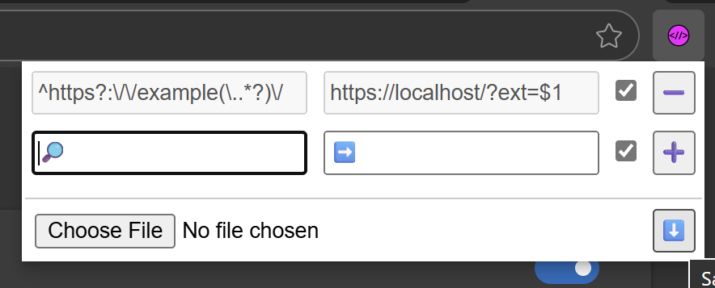

# regurlator

A RegExp URL Redirector:

  * it allows one or more *RegExp* to match any website and automatically (if desired) redirect to the destination *URL*
  * it allows you to **save** or **restore** list of *rules* to apply
  * *no match? no problem!* - it does literally nothing else if rules did not apply

by [@WebReflection](https://x.com/WebReflection)

